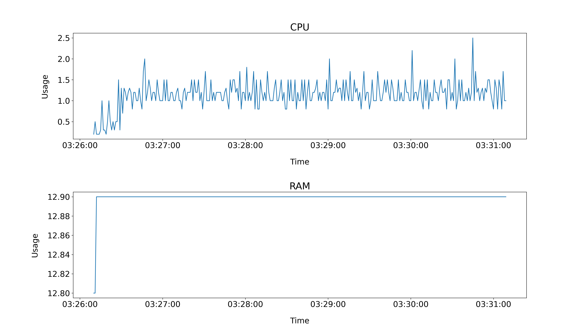

# Raspberry-Pi-Fan-Controller

Raspberry-Pi-Fan-Controller is a temperature based fan controller that turns the fan on when a certain temperature is reached and turns the fan off when the threshold isn't met anymore.

## Components

-   Raspberry Pi

-   Fan

-   2N2222 Transistor

-   10K ohm Resistor

## Schema


[RPI4 GPIO Pinout](media/GPIO-Pinout-Diagram.png)

[2N2222 Transistor](media/PN2222A.jpg)

## Prerequisites

-   Python 3.8+

-   Bash 4.2+

## Installation

### 1. Installation script

The installation script will create an executable script, a config file and if selected it will autostart the script at boot.

```bash
sh -c "$(wget -qO- https://raw.githubusercontent.com/0xharu/raspberry-pi-fan-controller/master/install.sh)"
```

To **uninstall** the program and all of its files use:

```bash
sh -c "$(wget -qO- https://raw.githubusercontent.com/0xharu/raspberry-pi-fan-controller/master/uninstall.sh)"
```

#### Manual inspection

It's always a good idea to inspect the installation script, you can do that by downloading the installation script first, looking through it and then running it.

```bash
wget -q https://raw.githubusercontent.com/0xharu/raspberry-pi-fan-controller/master/install.sh
```

### 2. Clone the repository

```bash
git clone https://github.com/0xharu/raspberry-pi-fan-controller.git
```

### 3. DownGit Links

-   [fan.py](https://downgit.github.io/#/home?url=https://github.com/0xHaru/Raspberry-Pi-Fan-Controller/blob/master/fan.py)

-   [fan.sh](https://downgit.github.io/#/home?url=https://github.com/0xHaru/Raspberry-Pi-Fan-Controller/blob/master/fan.sh)

## Usage

If you cloned the repository or used the DownGit links use: `python3 fan.py` or `bash fan.sh`.

If you used the installation script and installed only one of the scripts use: `fan`

If you installed both scripts use: `fan-py` or `fan-sh`.

In my experience even if the benchmarks are pretty much the same the python script seems to perform better and triggers the fan less frequently compared to the bash script.

## Autostart

To autostart the script either use the installation script or edit your crontab list.

#### How to edit your crontab list:

1. `chmod +x <script>`

2. `crontab -e`

3. Add this line at the end of the file: `@reboot /path/to/the/script >/dev/null 2>&1 || touch "$HOME/Desktop/AUTOSTART_FAILED"`

In case the script fails to autostart a file will be created on the desktop to alert the user.

If you installed the bash script add `sudo` before the path.

## Run the script as a deamon

`nohup fan >/dev/null 2>&1 &`

I recommend using an alias like: `alias fan-d="nohup fan >/dev/null 2>&1 &"`

To kill the process use: `kill -9 <PID>`

The PID is returned by `fan-d`.

## Benchmark

I benchmarked both scripts, I measured CPU and RAM usage every second for 5 minutes and plotted the collected data with Matplotlib.

### Python



CPU AVG: 1.1428%

RAM AVG: 12.8993%

### Bash


CPU AVG: 1.1505%

RAM AVG: 12.7267%

## Useful Resources

### RPI

[github.com/mishka/RaspberryPiFanController](https://github.com/mishka/RaspberryPiFanController)

[raspberrypi-aa.github.io/session2/bash.html](https://raspberrypi-aa.github.io/session2/bash.html)

[medium.com/coinmonks/controlling-raspberry-pi-gpio-pins-from-bash-scripts-traffic-lights](https://medium.com/coinmonks/controlling-raspberry-pi-gpio-pins-from-bash-scripts-traffic-lights-7ea0057c6a90)

### Cron

[cyberciti.biz/faq/linux-execute-cron-job-after-system-reboot](https://www.cyberciti.biz/faq/linux-execute-cron-job-after-system-reboot/)

### Misc

[cyberciti.biz/faq/how-to-redirect-output-and-errors-to-devnull](https://www.cyberciti.biz/faq/how-to-redirect-output-and-errors-to-devnull/)

[linux.com/training-tutorials/how-kill-process-command-line](https://www.linux.com/training-tutorials/how-kill-process-command-line/)

## License

This project uses the following license: [MIT](LICENSE).
